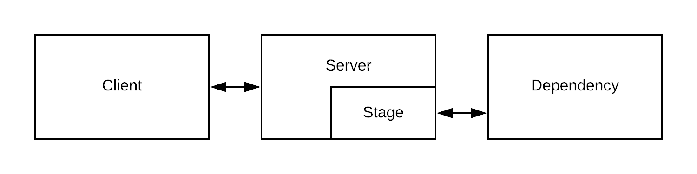

# Quartermaster - Formalization

A fault tolerant technique can be generalized as a stage, consisting of a queue for inbound events, a worker pool to process events from the queue, and a set of overloadable event driven methods.

This document describes the Quartermaster model. To see an implementation of this model, [read up on the framework](framework.md).

## Table of Contents

**[1. Stage](#Stage)**

**[2. Queue](#Queue)**

**[3. Worker Pool](#Worker-Pool)**

**[4. Event](#Event)**

**[5. Methods](#Event-Methods)**

## Stage

_Diagram 1: The main components of a web system_

A stage is a fault tolerant technique. That is, individual techniques can all be represented as some configuration of a stage. The stage lives in the server and it is the part of the server that connects to the dependency. To the server, the stage _is_ no different from the dependency itself.

The stage design used by the quartermaster was inspired by SEDA1, staged event-driven architecture. In SEDA, events pass through a set of stages conected by queues. Each stage does some work and passes it on to some other stages. Similarly, the Quartermaster's stages contain a queue of events which are processed in the stage, before being handed off to some other stage.

A stage is composed of a queue, a worker pool, and several methods which are triggered on key events. We describe these in their corresponding sections below. The stage guarantees the flow of an event through it. The high-level flow is:

1. An event is given to the stage
2. The stage can be accept or rejecte the event before it enters the queue.
3. An event enters the queue
4. The stage performs some work
5. If the work succeeded, the stage records a success, else the stage records a failure

To model more than one technique, such as a dependency that has a timeout and a retry pattern, stages can be chained. The retry stage sits in front of the timeout stage. The retry's work would involve waiting for either a real response or a signal from the timeout stage and trying again if needed.

[1]: While [SEDA](http://www.sosp.org/2001/papers/welsh.pdf) was proposed as a way to architect software systems, not all actual systems are architected in this form. It can be complex to design an equivalent non-staged system in SEDA and verify that its behavior is identical. Thus, we chose not to use the exact SEDA architecture for Quartermaster. Quartermaster is flexible to support non-SEDA and SEDA architectures alike.

## Queue

The queue is a buffer within the stage where events can wait to be be removed from the queue by a worker and worked on by the stage. Not all stages have a queue. (However, a stage without a queue is effectively equivalent to a stage with unlimited length queue and unlimited size worker pool.)

The queue affects the timing, order, and quantity of events allowed into the stage. The queue itself can be a technique used in graceful degradation. For example, a FIFO queue with a fixed length can act as a shock absorber for incoming traffic. As events arrive at a varying pace, a queue and worker pool allows for load-leveling.

## Worker Pool

The worker pool is a set of objects (workers) which pull events from the queue to be worked on by the stage. A worker becomes busy when it retrieves at least one event from the queue. A busy worker cannot retrieve additional events from the queue until it is freed. A busy worker is freed when the stage has completed working on the event(s) the worker has.

The worker pool affects the rate at which events are served and the number of events being worked on concurrently by the stage.

## Event

An event is contextual data that is sent to a dependency. In a web server with a remote dependency, the event is analogous to an HTTP request. The event is a key, which describes the resource that is being requested. That is, two different events with the same key are asking for the same data from the dependency.

Referring to _Diagram 1_, events traditionally originate in the client, are sent to the server, then to the stage, and finally to the dependency. Additionally, stages can create events, which can serve to help further isolate the server and the dependency.

## Event Methods

Event methods are triggered as an event flows through a stage. These methods are the minimal set of events needed to describe any techniques to be represented (such as retries, timeouts, caches, etc). Additional events could be added out of convenience, but many of those can be done using this minimal set.

The event methods on the stage are:

1. A method called before the event enters the stage's queue.
2. A method called when the event leaves the queue to be serviced.
3. A method called when the work done by the stage succeeded.
4. A method called when the work done by the stage failed.
